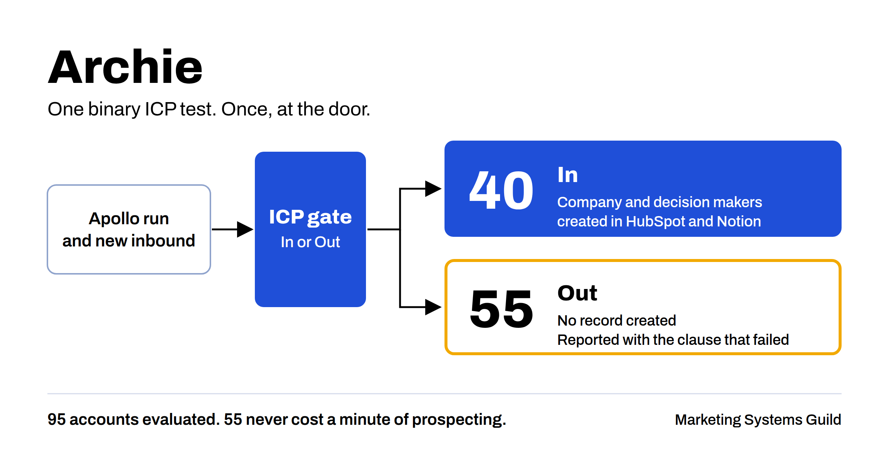

# Archie

## What problem does it solve?

Can your outbound program answer these two questions: is this account actually a fit, and which channel produced it? Fit scores look rigorous but rest on weights nobody validated. Source fields get left blank. Months later the pipeline is full and nobody can say what worked.

## How does it solve it?

Archie evaluates every new account once, at the door. It pulls candidates from Apollo or takes new inbound, applies a binary In or Out ICP test, and writes the accounts that pass into HubSpot and Notion with the source on every contact. Accounts that fail get no record, only a line in the digest naming the clause that failed.

## What does it unlock?

Prospecting time goes only to accounts that pass. In one run, Archie evaluated 95 accounts and passed 40. The other 55 never cost a minute of prospecting.

## Why binary, not a score?

A score implies precision you do not have. A pass or fail gate stays honest until you have the conversion data to train a real model.

## What do I need first?

Read [the prerequisites](../skills/archie/references/prerequisites.md). The short version:

- Apollo, HubSpot and Notion connectors turned on in Claude
- Four custom HubSpot properties
- Your ICP in a Notion page or doc, written using [the sample template](../skills/archie/references/icp.sample.md)

## How do I use it?

1. Write your ICP in a Notion page or doc, using the sections in [the sample template](../skills/archie/references/icp.sample.md).
2. Say: "Run Archie on this week's Apollo list, using the ICP at [link]." Or paste a new inbound lead and say: "Qualify this against the ICP at [link]."
3. Read the digest. Every In, every Out and the reason for each.

## What will it not do?

- Score or rank accounts
- Re-evaluate an account it has already seen, even after the ICP changes
- Touch an account someone is working, has worked or has closed
- Run on a cached ICP when the source is unreachable
- Trust the CRM's industry field over the company's own website
- Report a clean run without reading back every field it wrote
