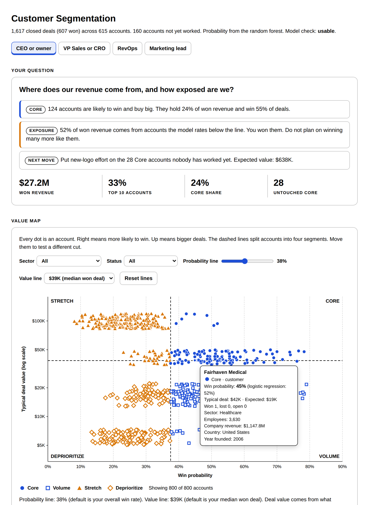

# Customer Segmentation

## What problem does it solve?

Most teams chase every account the same way. Nobody can say which accounts win, which ones pay, or how much revenue rides on a handful of customers.

## How does it solve it?

Upload your accounts and your won and lost deals. Two models, logistic regression and random forest, learn what a winning account looks like from its firmographics. Every account gets a win probability, a typical deal value and a segment. Claude writes the readout for your seat and builds an interactive tool.

## What does it unlock?

A ranked list of who to work next, the attributes that separate winners from losers, and a straight answer on how exposed your revenue is.

## Four readouts, one analysis

Tell Claude your seat. The math is the same. The answer is built for the question you bring.

| Seat | The question it answers |
|---|---|
| CEO or owner | Where does our revenue come from, and how exposed are we? |
| VP Sales or CRO | Which accounts should reps work first? |
| RevOps or GTM ops | Can I trust this model? |
| Marketing lead or agency | Who should we target, and what do they look like? |

## What are the four segments?

Win probability crossed with typical deal value.

| Segment | Likely to win? | Big deals? | What to do |
|---|---|---|---|
| Core | Yes | Yes | Work these first |
| Volume | Yes | No | Work them efficiently |
| Stretch | No | Yes | Pursue on purpose, never by default |
| Deprioritize | No | No | Stop spending here |

The lines default to your overall win rate and your median won deal. Drag them in the tool to test a different cut.

## What does the tool show?

- **Value map.** Every account as a dot. Filter by sector or status. Hover for the detail.
- **Segments.** Accounts, customers, win rate, won revenue and share for each.
- **Concentration risk.** How much revenue rides on your largest accounts, and how much comes from accounts that do not fit.
- **Pipeline opportunity.** Open deals weighted by fit, untouched accounts valued by fit, and a work list.
- **Probability of conversion.** Every account's score from both models, searchable, with a check on whether the percentages hold up.
- **Key fit attributes.** What drives a win, labeled Both agree, Curved, Straight line, Weak or No signal. Win rate by value for each.
- **Model check.** Whether to trust any of it, in plain words.

## Why two models?

Logistic regression is easy to read and only draws straight lines. Random forest catches curves and combinations and is hard to read. The skill tests both on accounts they never saw. The one that ranks better sets the probability. The other is the second opinion.

When they disagree about an attribute, the effect is a curve. In the sample, mid-size companies win 56% of deals and both ends win about 20%. The regression calls company size nearly irrelevant. The forest calls it the top driver. The tool flags it.

The full plain-language guide covers what each model does, how it works, how to read it and when not to trust it: [the model guide](../skills/customer-segmentation/references/model-guide.md).

## How does it know when not to trust itself?

- Every account with history is scored by models that never saw it
- A check score from 0.50 (coin flip) up. Under 0.60, no segments, just win rate tables
- A calibration check: does a 40% score win about 40% of the time?
- Attributes under 1.5 points of importance read as No signal, so noise never passes for a pattern
- Any account where the models differ by 25 points gets a Check tag

## What do I need first?

Read [the prerequisites](../skills/customer-segmentation/references/prerequisites.md). The short version:

- Any Claude plan with code execution on
- A deals CSV with won and lost deals, 12 to 24 months, each naming its account
- Firmographics per account: sector, employees, revenue, country, year founded, parent company. At least one
- 100 closed deals across 30 accounts at minimum. 300 or more is better
- For scores on accounts nobody has worked: a separate accounts file with your full target list

No connectors or MCP servers are needed.

## How do I use it?

1. Export your deals and accounts. Steps for each CRM: [export guide](../skills/customer-segmentation/references/export-guide.md).
2. Upload the files to Claude and say: "Segment our accounts. I'm the CRO." Swap in your own seat.
3. Open the tool file Claude hands back.

No export handy? Try [the sample data](../examples/customer-segmentation/) first, or open the [sample tool](../examples/customer-segmentation/sample_tool.html).

## What will it not do?

- Promise an account will buy. A probability ranks accounts. It does not predict the future
- Claim an attribute causes a win. It shows who wins, not why
- Score intent, timing or relationships. Firmographics only
- Show a percentage behind fewer than 10 deals
- Run on too little history. Under 100 closed deals, it stops

## Where does the sample data come from?

It is synthetic. Every account, deal and rep is invented, laid out like Maven Analytics' CRM Sales Opportunities dataset, and published under MIT with the repo. Real patterns are planted in it so the models have something to find: strong and weak sectors, a company-size sweet spot, a parent-company penalty, a country effect, one attribute that is pure noise, and five oversized accounts that do not fit. The generator documents every one. See [the examples folder](../examples/customer-segmentation/).

## How was it tested?

Four test files: two files in the Maven layout, a single HubSpot-style export with revenue in dollars, a file with eight planted data problems, and one too small to model. Counts and concentration were recomputed independently and matched exactly. Both models recovered every planted pattern on every file, and the noise attribute read No signal every time. Every account with history was confirmed scored by models that never saw it. See [tests](../tests/customer-segmentation/).
