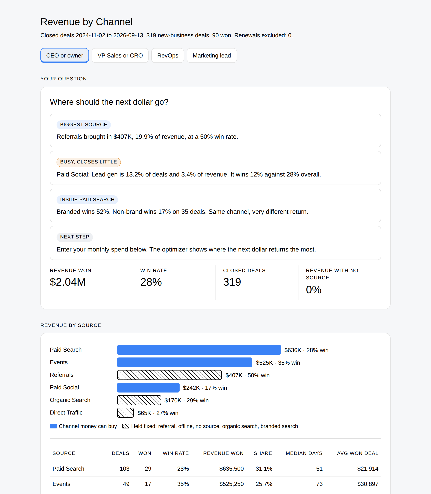
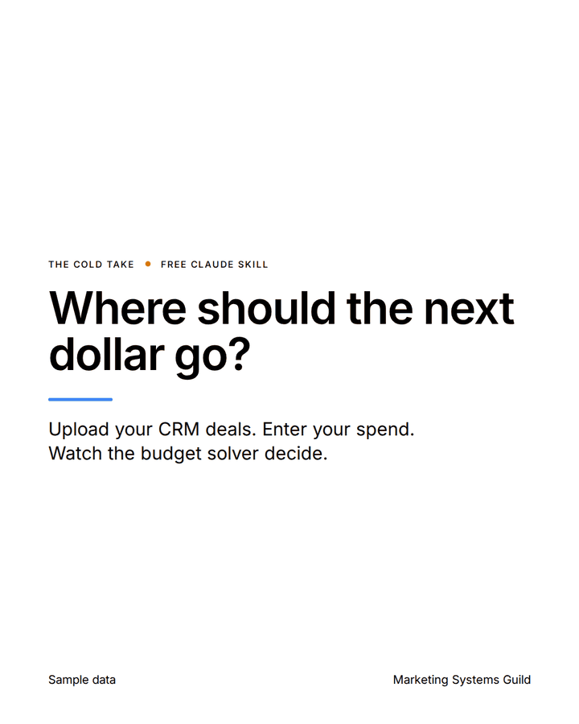
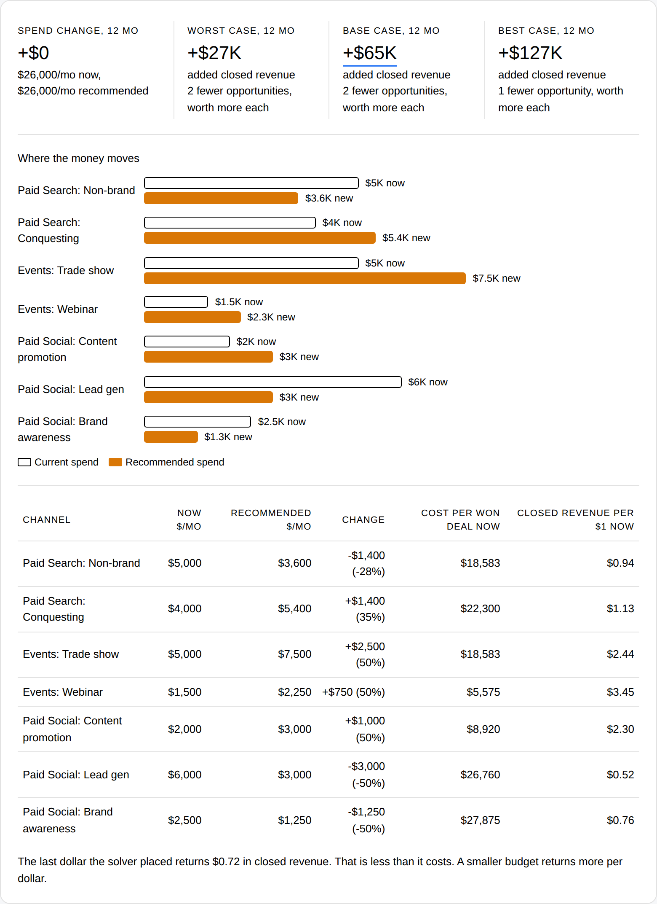

# Revenue by Channel

## What problem does it solve?

Most companies cannot say which channel produces closed revenue. Budget decisions run on opinion.

## How does it solve it?

Upload a deal export from HubSpot, Salesforce or any CRM. Claude returns revenue, win rate and sales cycle by source, tells you where the source data is broken, and builds an interactive report with a budget optimizer.

## What does it unlock?

A real revenue number per channel. The next dollar goes to what closes.

## Four readouts, one analysis

Tell Claude your seat. The math is the same. The answer is built for the question you bring.

| Seat | The question it answers |
|---|---|
| CEO or owner | Where should the next dollar go? |
| VP Sales or CRO | Which sources close fastest and at the highest rate? |
| RevOps or GTM ops | Can I trust this data? |
| Marketing lead or agency | Which channels can I defend in the next budget meeting? |

## How deep does it go?

Add a campaign column to the export and the skill splits channels into buckets:

| Channel | Buckets |
|---|---|
| Paid search | Branded, Conquesting, Non-brand, Retargeting |
| Paid social | Lead gen, Content promotion, Brand awareness, Retargeting |
| Events | Trade show, Webinar, Hosted event, Sponsorship |

Buckets come from keywords in your campaign names. Names it cannot read are reported as Unclassified, never guessed.

## What does the budget optimizer do?

Type in what you spend each month per channel. A linear program finds the mix that returns the most closed revenue for your budget, or the least spend to hit a target.

- Worst, base and best cases, with ranges set by how much data sits behind each channel
- Diminishing returns built in, so it never puts everything into one channel
- A plain-language readout of every run: what to move, what it is worth, how sure to be, where extra budget stops paying, and the next step
- Held fixed by default: referral, offline and unsourced revenue, organic search (it pays off 6 to 12 months later) and branded search (it captures demand that already exists). You can switch any of them back in

Spend you type stays in your browser.

## What do I need first?

Read [the prerequisites](../skills/revenue-by-channel/references/prerequisites.md). The short version:

- Any Claude plan with code execution on
- A CSV of won and lost deals, 12 to 24 months, with stage, amount, create date, close date and source
- At least 20 closed new-business deals
- For channel detail: UTM tags on every paid link and a campaign column in the export
- For the optimizer: your monthly spend per channel

No connectors or MCP servers are needed.

## How do I use it?

1. Export your deals. Steps for each CRM: [export guide](../skills/revenue-by-channel/references/export-guide.md).
2. Upload the CSV to Claude and say: "Where did our revenue come from? I'm the CEO." Swap in your own seat.
3. Open the report file Claude hands back.

No export handy? Try [the sample data](../examples/revenue-by-channel/) first, or open the [sample report](../examples/revenue-by-channel/sample_report.html).

## What will it not do?

- Claim ROI or cost per deal from the export alone. Only the spend you type in produces cost figures
- Guess a source for a blank field
- Show a win rate for a channel with fewer than 10 deals
- Recommend growing branded search

## How was it tested?

Four test files, including one with a dozen planted data problems and one with blank and unreadable campaign names. Every number matched an answer key built independently of the skill. The optimizer's allocation matched an independent linear programming solver exactly. See [tests](../tests/revenue-by-channel/).
